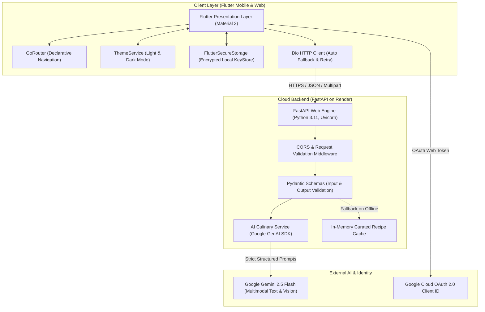

# 🍲 RasoiAI — Intelligent Indian Culinary Assistant

<div align="center">

[](https://flutter.dev)
[](https://dart.dev)
[](https://fastapi.tiangolo.com)
[](https://python.org)
[](https://ai.google.dev)
[](https://recipie-generator-qwj4.onrender.com)
[](LICENSE)

**An AI-driven mobile cooking companion designed specifically for authentic Indian home kitchens.**  
*Transform pantry leftovers into regional delicacies, identify dishes from camera snaps, and customize spice levels, diet, and kitchen budgets in real time.*

[Live Backend API](https://recipie-generator-qwj4.onrender.com) • [API Documentation](https://recipie-generator-qwj4.onrender.com/docs) • [Report Issue](https://github.com/ymukeshram/recipie_generator/issues)

</div>

---

## 🌟 Key Highlights & Features

* **🍳 Leftovers-to-Recipe Generator**: Enter whatever you have in the fridge (e.g. *"2 tomatoes, ginger, curd, besan"*) and get step-by-step authentic Indian dishes.
* **📸 Multimodal Food Vision**: Snap a photo of any food item or curry; the vision model identifies the dish and produces the complete regional recipe.
* **🌶️ Authentic Indian Culinary Nuances**:
  * Accurate spice bloom orders (*tadka / chaunk / vaghar*).
  * Regional techniques (*dum*, *bhunao*, slow simmering).
  * 9+ Indian culinary profiles: North Indian, South Indian, Punjabi, Maharashtrian, Bengali, Gujarati, Chettinad, Rajasthani, and Awadhi.
* **🥗 Dietary Safeguards & Cost Estimates**:
  * Strict dietary adherence (Vegetarian, Vegan, Jain no onion/garlic, Non-Veg).
  * Accurate Indian grocery cost per serving (`Est. ₹[cost]/serv`).
* **🌓 Light & Dark Theme**: Full dynamic theme switching across all dashboard and detail pages.
* **💾 Persistent Offline-First History & Bookmarks**: Full generation history and favorite recipes preserved locally in encrypted device storage (`FlutterSecureStorage`).
* **🔐 Google OAuth 2.0 Integration**: One-tap sign-in with Google OAuth credentials.

---

## 🏗️ System Architecture

RasoiAI utilizes a decoupled client-server architecture with API key isolation to ensure high performance, security, and low latency:



### Architectural Design Principles:
1. **API Key Isolation**: The mobile APK **never** holds the `GEMINI_API_KEY`. It communicates exclusively with the backend via HTTPS, preventing reverse-engineering leaks.
2. **Offline-First Resilience**: If the cloud service is sleeping or network drops, the app falls back to curated in-memory dishes and locally stored recipe history.
3. **Structured Culinary Extraction**: Gemini outputs strict JSON matching Pydantic schemas, eliminating parsing failures.

---

## 💻 Tech Stack

| Layer | Technologies |
| :--- | :--- |
| **Mobile Frontend** | Flutter 3.x, Dart 3.x, Material 3, Riverpod, GoRouter |
| **Networking & Local Storage** | Dio, FlutterSecureStorage (Android Keystore / AES), ImagePicker |
| **Backend API** | FastAPI, Uvicorn (ASGI), Python 3.11, Pydantic v2 |
| **AI / Machine Learning** | Google Gemini 2.5 Flash (`google-genai` SDK), Pillow (Vision) |
| **Cloud Hosting** | Render Web Service (Auto SSL, Python 3.11 container runtime) |
| **Authentication** | Google OAuth 2.0 Web Client, Local Secure Session |
| **Containerization** | Docker, Linux Debian-slim |

---

## 📡 REST API Design

Live Base URL: `https://recipie-generator-qwj4.onrender.com/api/v1`  
Interactive Swagger Docs: `https://recipie-generator-qwj4.onrender.com/docs`

### 1. Generate Recipe
* **Endpoint**: `POST /recipes/generate`
* **Content-Type**: `application/json`
* **Request Payload**:
```json
{
  "dish_name": "Paneer Bhurji",
  "available_ingredients": ["paneer", "tomatoes", "green chillies", "onion"],
  "excluded_ingredients": ["garlic"],
  "cuisine": "North Indian",
  "meal_category": "Dinner",
  "servings": 2,
  "max_time_minutes": 20,
  "budget_inr": 150,
  "spice_level": "Medium",
  "dietary_preference": "Vegetarian"
}
```
* **Response Payload (`200 OK`)**:
```json
{
  "id": "recipe-4a8b2c",
  "dish_name": "Dhaba-Style Paneer Bhurji",
  "description": "Scrambled cottage cheese tossed with sautéed onions, tomatoes, and aromatic Indian spices.",
  "cuisine": "North Indian",
  "meal_category": "Dinner",
  "prep_time_minutes": 5,
  "cook_time_minutes": 15,
  "total_time_minutes": 20,
  "servings": 2,
  "difficulty": "Easy",
  "spice_level": "Medium",
  "ingredients": [
    {"name": "Paneer (Crumbled)", "quantity": 200, "unit": "g"},
    {"name": "Tomatoes (Finely chopped)", "quantity": 2, "unit": "piece"},
    {"name": "Kasuri Methi", "quantity": 1, "unit": "tsp"}
  ],
  "instructions": [
    {"step_number": 1, "instruction": "Heat oil in a pan, bloom cumin seeds and sauté green chillies."},
    {"step_number": 2, "instruction": "Add chopped tomatoes and dry spices; cook until oil releases."},
    {"step_number": 3, "instruction": "Fold in fresh crumbled paneer and finish with crushed kasuri methi."}
  ],
  "cost_estimate_inr": 120.0,
  "nutrition": {
    "calories": 310,
    "protein_g": 18.0,
    "carbs_g": 8.0,
    "fat_g": 22.0,
    "fiber_g": 2.5
  },
  "dietary_tags": ["Vegetarian", "High Protein"],
  "allergy_warnings": ["Contains Dairy"]
}
```

---

### 2. Food Image Analysis
* **Endpoint**: `POST /recipes/analyze-image`
* **Content-Type**: `multipart/form-data`
* **Request**: Binary image file (`file`)
* **Response (`200 OK`)**:
```json
{
  "identified_dish": "Masala Dosa",
  "confidence_score": 0.96,
  "estimated_cuisine": "South Indian",
  "primary_ingredients": ["Rice batter", "Potato masala", "Curry leaves", "Mustard seeds"],
  "dietary_category": "Vegetarian"
}
```

---

### 3. Service Health Check
* **Endpoint**: `GET /health`
* **Response (`200 OK`)**:
```json
{
  "status": "healthy",
  "gemini_configured": true,
  "supabase_configured": false
}
```

---

## 🔒 Security & Data Privacy

* **Zero Hardcoded Secrets**: All API credentials (`GEMINI_API_KEY`) are managed strictly through server-side environment variables.
* **Encrypted Device Keystore**: Sessions, generation history, and saved bookmarks are encrypted locally on the user's phone via `FlutterSecureStorage` using the Android Keystore.
* **Domain-Restricted OAuth**: Google OAuth 2.0 Web Client is bound to authorized domains (`recipie-generator-qwj4.onrender.com`), blocking third-party origin hijacking.
* **Strict Schema Validation**: Pydantic v2 prevents injection vulnerabilities and ensures clean, sanitary JSON outputs.

---

## 🚀 Local Development Setup

### Prerequisites
* [Flutter SDK 3.19+](https://docs.flutter.dev/get-started/install)
* [Python 3.11+](https://www.python.org/downloads/)
* [Google Gemini API Key](https://aistudio.google.com/app/apikey)

### 1. Clone the Repository
```bash
git clone https://github.com/ymukeshram/recipie_generator.git
cd recipie_generator
```

### 2. Backend Setup
```bash
# Create and activate virtual environment
python -m venv venv
# Windows:
.\venv\Scripts\activate
# Linux/macOS:
source venv/bin/activate

# Install dependencies
pip install -r requirements.txt

# Create .env file
cp backend/.env.example backend/.env
# Add your GEMINI_API_KEY inside backend/.env

# Run development server
uvicorn main:app --host 0.0.0.0 --port 8000 --reload
```
API will be live at `http://127.0.0.1:8000`.

### 3. Frontend Setup
```bash
# Install Flutter dependencies
flutter pub get

# Run tests
flutter test

# Run Flutter Web Preview
flutter run -d chrome

# Build Android APK
flutter build apk --debug
```
The compiled APK will be at `build/app/outputs/flutter-apk/app-debug.apk`.

---

## 🐳 Docker Deployment

You can build and run the backend locally or on any cloud server using Docker:

```bash
cd backend
docker build -t rasoiai-backend .
docker run -p 8000:8000 -e GEMINI_API_KEY="your-gemini-key" rasoiai-backend
```

---

## 📱 Mobile APK Usage

The latest debug APK is pre-configured with the live production backend.

1. Download the APK onto your Android phone:
   ```text
   http://192.168.1.43:8080/app-debug.apk
   ```
2. Install the APK (Allow *Install Unknown Apps* if prompted).
3. The app is ready—connect over 4G/5G or any Wi-Fi to start generating authentic Indian recipes!

---

## 📄 License
This project is open-source and licensed under the [MIT License](LICENSE).
